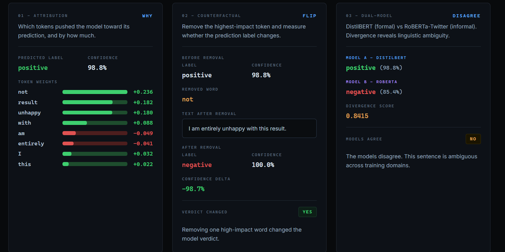
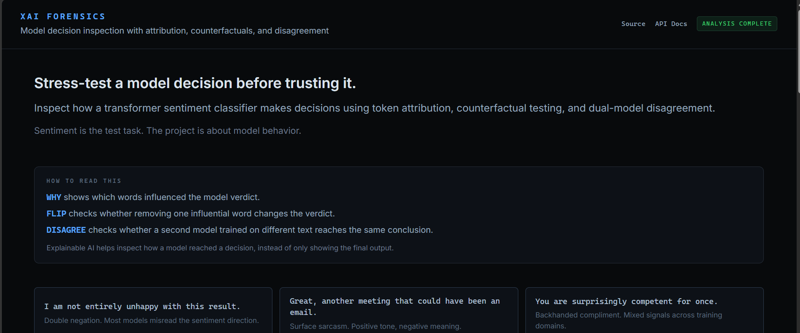
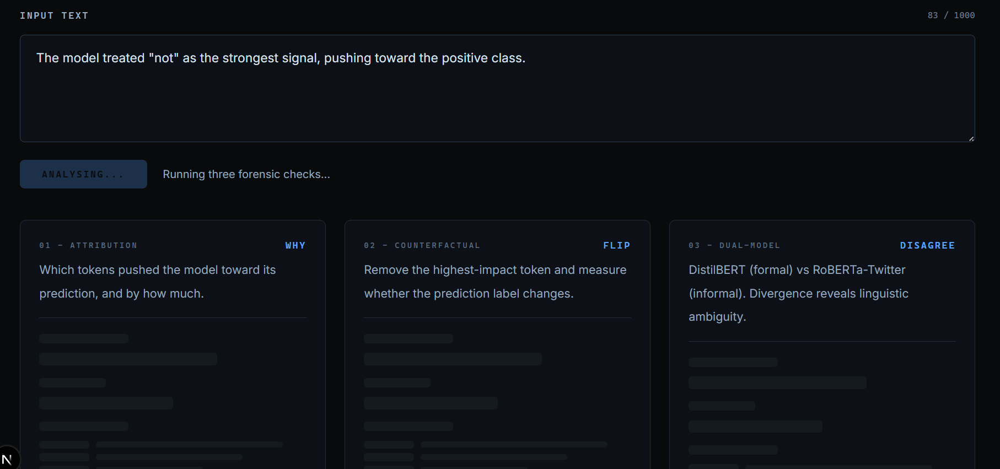
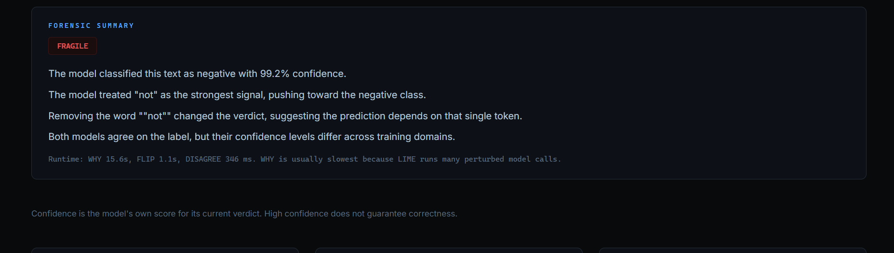
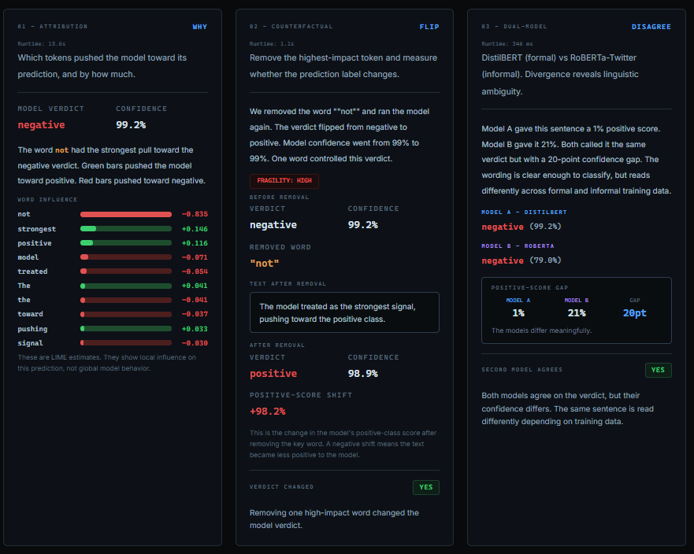
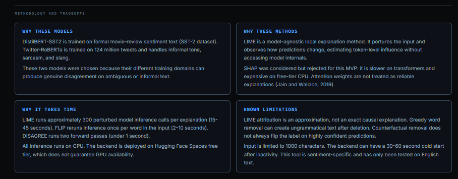

# XAI Forensics

A diagnostic tool for evaluating when LIME token attributions are trustworthy on transformer sentiment classifiers. Runs three independent forensic checks (attribution stability, counterfactual faithfulness, cross-model agreement) and validates results against a 30-input pre-registered audit.

**Key finding:** high-confidence predictions (>95%) produce the least stable attributions (mean Jaccard 0.46 on strong baselines), while lexical-shortcut inputs are perfectly faithful (Jaccard 1.0, 100% flip rate). This tool shows you when LIME is signal vs. noise.

Sentiment classification is the controlled test task. The project evaluates the explanation method, not the classifier output.


## Live Demo

| Component | Link |
|-----------|------|
| Frontend | [xai-forensic.vercel.app](https://xai-forensic.vercel.app/) |
| Backend API | [jainparshvi-xai-forensics-backend.hf.space](https://jainparshvi-xai-forensics-backend.hf.space) |
| API Docs (Swagger) | [/docs](https://jainparshvi-xai-forensics-backend.hf.space/docs) |

**Demo input:** `I am not entirely unhappy with this result.`

This sentence contains a double negation that causes the two models to genuinely disagree.

> The backend runs on Hugging Face Spaces free tier. If the Space has been idle, the first request triggers a cold start (30-60 seconds) while models download. Subsequent requests are faster.









## What This Does

XAI Forensics runs three independent diagnostic checks on any short English text:

1. **WHY (Attribution Stability)** - Tests whether LIME can produce a stable, reproducible token ranking for a given prediction. Seeds the random state for deterministic output.
2. **FLIP (Counterfactual Faithfulness)** - Tests whether the tokens LIME identifies as important are actually causally influential. Removes the top-attributed word and measures the real confidence shift.
3. **DISAGREE (Cross-Model Consistency)** - Tests whether the prediction itself is domain-stable enough to warrant attribution analysis. Compares DistilBERT-SST2 against Twitter-RoBERTa.

Each check targets a different failure mode of LIME: instability under re-sampling, unfaithfulness to the model's actual reasoning, and domain sensitivity of the underlying prediction.

### Audit Results

A pre-registered 30-input audit (5 seeds each, 150 total LIME runs) found:
- Overall mean Jaccard stability: **0.81** (passes 0.6 threshold)
- Deletion faithfulness direction correct: **89.3%** (passes 70% threshold)
- Strong baselines category (high confidence): **Jaccard 0.67** (lowest category, driven by redundant evidence)
- Lexical shortcuts category: **100% label flip rate** (highest faithfulness)

Full interactive results available at [/audit](https://xai-forensic.vercel.app/audit).

## How It Works

### WHY: LIME Token Attribution

Uses [LIME](https://arxiv.org/abs/1602.04938) (Ribeiro et al., 2016) for model-agnostic local explanations. LIME generates perturbed versions of the input text, reruns the classifier on each perturbation, and fits a local linear model to estimate which tokens most influenced the prediction.

- Runs 300 perturbation samples per explanation
- Returns the top 10 tokens with signed weights (positive = pushes toward positive class)
- SHAP was considered and rejected: slower for transformers, expensive on free-tier CPU
- Attention weights were rejected as explanations per Jain and Wallace (2019)

### FLIP: Counterfactual Word Removal

Removes each word one at a time, reruns inference, and finds the word whose removal causes the largest confidence shift. Shows the full before-and-after comparison: original label, modified label, confidence delta, and whether the verdict changed.

- Greedy O(n) search over words in the input
- Deterministic, no generation model required
- Word removal can create ungrammatical text (documented limitation)
- Does not always flip the label on highly confident predictions

### DISAGREE: Dual-Model Divergence

Runs the same text through both models and computes the absolute difference in their positive-class confidence scores. A high divergence score means the models have different views on the same text, which reveals linguistic ambiguity across training domains.

- Divergence = abs(positive_score_A - positive_score_B)
- This is an interpretable confidence delta, not a formal divergence metric like KL divergence
- KL divergence was considered and rejected: harder to interpret for non-technical audiences


## Models Used

| Model | Training Data | Strength |
|-------|---------------|----------|
| [distilbert-base-uncased-finetuned-sst-2-english](https://huggingface.co/distilbert-base-uncased-finetuned-sst-2-english) | SST-2 movie reviews | Formal, structured English |
| [cardiffnlp/twitter-roberta-base-sentiment-latest](https://huggingface.co/cardiffnlp/twitter-roberta-base-sentiment-latest) | 124M tweets | Sarcasm, slang, informal tone |

These two models are chosen because they genuinely disagree on informal or ambiguous language. DistilBERT expects clean, formal text. Twitter-RoBERTa handles internet language better. This domain mismatch makes the DISAGREE panel meaningful rather than artificial.

## Architecture

```
Frontend (Vercel)              Backend (HF Spaces Docker)
Next.js + Tailwind             FastAPI + PyTorch
       |                              |
       |--- POST /why   ------------->|--- LIME (300 perturbations)
       |--- POST /flip  ------------->|--- Greedy word removal
       |--- POST /disagree ---------->|--- Dual model inference
       |                              |
       |<---- JSON responses ---------|
```

- Frontend and backend are fully decoupled
- All endpoints accept `{"text": "..."}` and return structured JSON
- Frontend calls all three endpoints in parallel using `Promise.allSettled`
- Models load once at container startup, not per request

## Run it Locally

### Backend

```bash
cd backend
python -m venv venv
source venv/bin/activate  # Windows: venv\Scripts\activate
pip install -r requirements.txt
uvicorn main:app --reload --port 8000
```

First run downloads models (~500MB total). Subsequent starts use cached weights.

### Frontend

```bash
cd frontend
npm install
npm run dev
```

Frontend runs at `http://localhost:3000` and calls the backend at `http://localhost:8000` by default. To change the backend URL, set `NEXT_PUBLIC_API_URL` in `frontend/.env.local`.


## API Endpoints

All endpoints accept POST with `Content-Type: application/json` and a body of `{"text": "your input"}`.

| Endpoint | Returns |
|----------|---------|
| `POST /why` | Predicted label, confidence, and top 10 token weights from LIME |
| `POST /flip` | Original and modified labels, removed word, confidence delta, verdict changed status |
| `POST /disagree` | Both model predictions, divergence score, agreement status |
| `GET /` | Health check: `{"status": "ok"}` |
| `GET /docs` | Interactive Swagger API documentation |

Input is limited to 1000 characters. Requests with longer text return HTTP 400.


## Latency Notes

| Endpoint | Approx. CPU time | Why |
|----------|-------------------|-----|
| `/why` | 15-45 seconds | LIME runs 300 model inference calls per explanation |
| `/flip` | 2-10 seconds | One model call per word in the input |
| `/disagree` | Under 1 second | Two forward passes |

LIME is the main latency source. CPU inference is used because deployment is on the Hugging Face free tier, which does not guarantee GPU availability. This is acceptable for a demo tool with short text inputs.


## Latency Benchmark

The backend runs on Hugging Face Spaces free-tier CPU. The table below reports median endpoint runtime across 3 runs after one warmup request. Timings are approximate because free-tier CPU performance varies.

| Words | WHY median | FLIP median | DISAGREE median |
|---:|---:|---:|---:|
| 5 | 4.5s | 414ms | 98ms |
| 10 | 5.8s | 270ms | 75ms |
| 20 | 6.1s | 475ms | 72ms |
| 50 | 8.3s | 4.2s | 104ms |

WHY is slowest because LIME generates perturbed versions of the input and reruns model inference many times. FLIP scales with word count because it removes candidate words one at a time and reruns inference. DISAGREE is fastest because it only runs two model forward passes.

The benchmark can be reproduced with `scripts/benchmark_latency.py`.


## Security and Cost

- No paid APIs. Both models are public Hugging Face models.
- No database. Nothing is stored.
- No authentication. This is a public demo tool.
- No user data is collected, logged, or persisted.
- CORS allows all origins (appropriate for a public demo with no sensitive operations).
- Input capped at 1000 characters to prevent LIME timeouts on free-tier CPU.


## Known Behavior and Limitations

Single-word inputs are not ideal for this tool. LIME works by perturbing parts of the input and observing prediction changes. With only one word, there is very little structure to perturb, so the explanation can be unstable or uninformative. In testing, short inputs such as "Fine." can produce domain-sensitive behavior because different models interpret minimal context differently.

Highly confident predictions may not flip after one-word removal. For example, strongly positive sentences such as "I absolutely love this, it is the best thing ever." often remain positive after removing one word. This does not mean every word is irrelevant. It means the model found enough evidence across the sentence that removing one token did not change the final verdict.

Counterfactual removal can create ungrammatical text because the method deletes a word rather than rewriting the sentence. This is a deliberate MVP tradeoff. The FLIP panel is a fragility test, not a full natural-language counterfactual generator. For example, removing a key word from "I am not entirely unhappy with this result." can flip the verdict, but the modified sentence may not always be natural English.

Additional limitations:

- LIME explanation takes 15-45 seconds on CPU for short text
- Input limited to 1000 characters
- Hugging Face free tier sleeps after inactivity; first request after sleep has a 30-60 second cold start
- Only tested on English text
- Sentiment-specific; adapting to other tasks would require different models and possibly different XAI methods


## Tech Stack

| Layer | Technology |
|-------|-----------|
| Backend | Python, FastAPI, PyTorch, Hugging Face Transformers, LIME |
| Frontend | Next.js, React, Tailwind CSS |
| Backend deployment | Hugging Face Spaces (Docker) |
| Frontend deployment | Vercel |
| ML models | DistilBERT-SST2, Twitter-RoBERTa |
| Infrastructure cost | Zero (free tier only) |


## License

MIT
