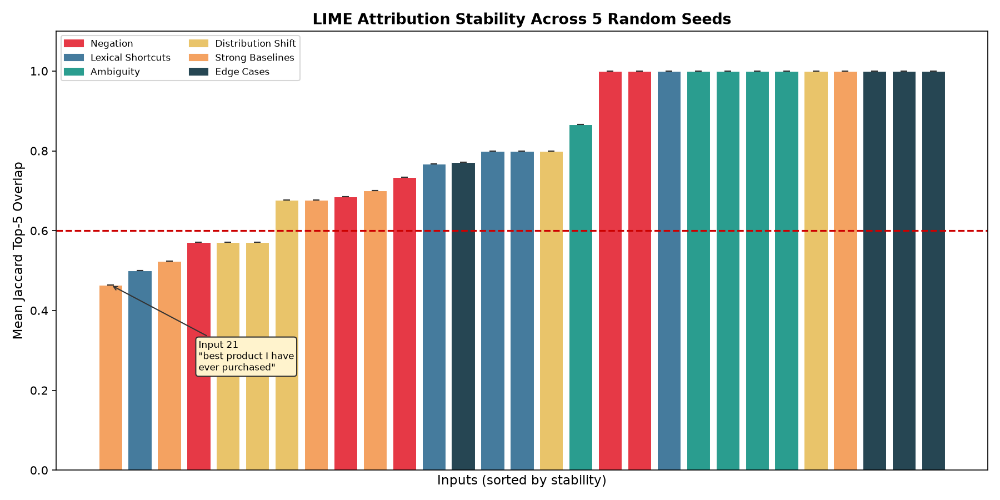
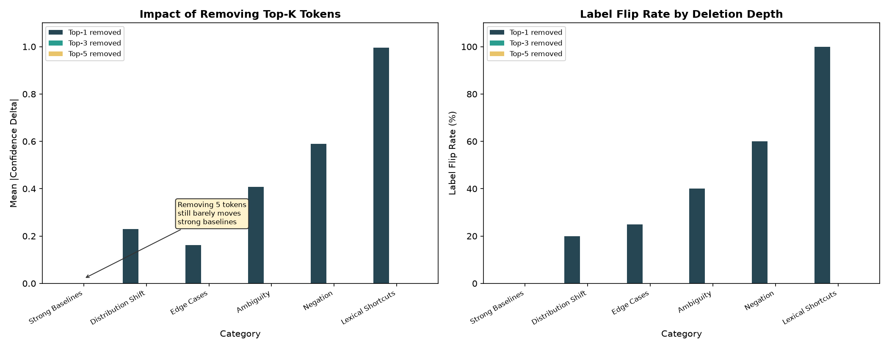

# I Audited LIME on 30 Inputs and Found It Fails on the Easiest Ones

LIME is one of the most cited explanation methods in machine learning. It tells you which words in a sentence drove a classifier's prediction. But does it give you the same answer twice?

I ran LIME on 30 carefully chosen inputs across 5 random seeds, measured whether the explanations stayed stable, and tested whether removing the "most important" token actually changed the model's output. The input with the worst stability was not the hardest or most ambiguous one. It was "This is the best product I have ever purchased."

## The Setup

I froze a test set of 30 inputs before looking at any results. The inputs span six categories designed to stress-test LIME: negation and minimal pairs ("This is not good" vs. "This is good"), lexical shortcuts where surface cues contradict the true sentiment, ambiguous sentences near the decision boundary, distribution shifts from domains like clinical notes and financial reports, strong baselines that any competent model should handle easily, and edge cases like repeated tokens or alternating contradictions.

The model is DistilBERT fine-tuned on SST-2 (the standard sentiment benchmark), pinned to an exact revision hash. LIME runs with 300 perturbation samples and returns the top 10 tokens ranked by attribution weight.

I measure two things:

**Stability**: For each input, I run LIME with five different random seeds and compute the Jaccard overlap of the top-5 attributed tokens across all 10 seed pairs. A Jaccard of 1.0 means every seed returned the same five tokens. A Jaccard of 0.25 means the explanations barely overlap.

**Deletion faithfulness**: Using the canonical seed, I identify the token LIME considers most important and remove it from the input. If LIME says a token has positive weight, removing it should decrease the model's positive score. If the score barely moves, the "most important" token was not actually important.

All thresholds, metrics, and the 30 inputs were frozen in a pre-registration protocol before seeing any results. The raw data, every CSV, and the runner code are public.

## The Surprise: Easy Inputs Are the Least Stable

The overall mean Jaccard is 0.81 [0.74, 0.87] (95% bootstrap CI), comfortably above the 0.60 threshold. That headline number looks fine. But the per-input distribution tells a different story.

The leftmost bar in the chart, the input with the worst stability of all 29 tested inputs, is Input 21: "This is the best product I have ever purchased." Its mean Jaccard is 0.46, with a minimum of 0.25 across seed pairs. This is an unambiguously positive sentence that any sentiment model handles with near-perfect confidence (0.9999).

Why does the easiest input have the worst explanation stability?

The sentence has nine whitespace tokens: "This", "is", "the", "best", "product", "I", "have", "ever", "purchased". Only one or two of those carry real sentiment signal ("best", maybe "purchased"). The remaining seven are function words with near-zero LIME weights. Across seeds, LIME assigns slightly different random weights to "is", "the", "I", "have", and "ever", causing them to shuffle positions in the top-5 ranking. The top-1 token is not even consistent, because "best" receives a weight of only 0.008, barely above the noise floor.

The instability is not about hard cases. It is about the signal-to-noise ratio between meaningful tokens and filler. Longer sentences with clear sentiment have more function words competing for top-5 slots with near-zero weights, making the ranking fragile.

The per-category breakdown confirms this. Strong baselines, the easiest category, have the second-worst mean Jaccard (0.67). Ambiguity, a category you would expect to be unstable, actually scores 0.97 because ambiguous sentences are short and nearly every token carries some signal.

| Category | Mean Jaccard | 95% CI |
|----------|-------------|--------|
| Ambiguity | 0.97 | [0.93, 1.00] |
| Edge cases | 0.94 | [0.86, 1.00] |
| Negation | 0.80 | [0.66, 0.93] |
| Lexical shortcuts | 0.77 | [0.62, 0.92] |
| Distribution shift | 0.72 | [0.61, 0.84] |
| Strong baselines | 0.67 | [0.52, 0.82] |

## LIME Says "This Token Matters." Deletion Says "Nothing Matters."

The deletion faithfulness test reveals a second, independent problem. Overall, 89% of deletions are directionally correct: if LIME says a token is positive, removing it decreases the score. That passes the 0.70 threshold. But the magnitude tells a different story.

The chart shows grouped bars for top-1, top-3, and top-5 token removal across categories. Lexical shortcuts: removing even one token ("loved" from "The movie was terrible but I loved every minute of it") causes a confidence swing of 0.987 and a full label flip. LIME works perfectly here because one token genuinely dominates the prediction.

Strong baselines tell the opposite story. Inputs where the model is 0.9999 confident show mean |delta| of 0.0002 even when removing the top 5 tokens. Not a single strong baseline input flips its label at any deletion depth. LIME is directionally correct but the deletion test is powerless. When a model outputs 0.9999, removing five words drops it to 0.9995. The direction is right, but the magnitude is meaningless.

The per-category faithfulness numbers make this concrete:

| Category | Direction Correct | Flip Rate | Mean |Delta| |
|----------|------------------|-----------|------------|
| Lexical shortcuts | 100% | 100% | 0.995 |
| Ambiguity | 100% | 40% | 0.408 |
| Distribution shift | 100% | 20% | 0.230 |
| Negation | 80% | 60% | 0.590 |
| Strong baselines | 80% | 0% | 0.0002 |
| Edge cases | 75% | 25% | 0.162 |

LIME is faithful in direction but blind to magnitude. For high-confidence predictions, the standard one-token deletion test cannot distinguish a genuinely important token from a random one.

## The Tokenizer Problem Nobody Talks About

LIME splits text on whitespace. The model uses WordPiece tokenization. These are not the same thing.

When LIME sees "I'm", it treats that as one token. When DistilBERT sees "I'm", it splits it into three subword pieces: "i", "'", "m". LIME's perturbation masks whole whitespace tokens, but the model processes subwords. This means LIME's attribution is to whitespace tokens, not to the features the model actually uses. The mismatch is fundamental and cannot be fixed without replacing LIME's perturbation strategy.

Across the 29 tested inputs, the model's WordPiece tokenizer produces more tokens than LIME's whitespace splitter in the majority of cases. The worst mismatch occurs on longer sentences where compound words, contractions, and punctuation create divergent tokenizations. LIME attributes importance to a unit of text that does not correspond to how the model reads it.

## When to Trust LIME

LIME is not useless. It works well under specific conditions:

**Trust LIME when one token dominates.** Lexical shortcuts score 100% direction-correct and 100% label flip. When a sentence has a single decisive word that, if removed, reverses the prediction, LIME finds it reliably.

**Trust LIME on short inputs.** Shorter sentences have fewer near-zero-weight function words competing for top-5 slots. "This is good" (3 tokens) has perfect Jaccard across all seeds. "The quality exceeded all my expectations and I am thrilled" (11 tokens) drops to 0.68.

**Do not trust LIME when model confidence exceeds 0.99.** The deletion test becomes powerless. LIME will tell you a token is important, but removing it changes nothing measurable.

**Do not trust the ranking below rank 1.** The top-1 token is unanimous across seeds for 66% of inputs. Ranks 2 through 5 are where the instability lives. If you are reporting LIME results, report the top token and its weight. Do not treat the full ranking as meaningful.

**Be skeptical of LIME on long sentences with clear sentiment.** Counterintuitively, these are where LIME is least stable, because function words create ranking noise.

## Limitations

This audit tests 30 inputs, giving 4 to 5 data points per category. Per-category statistics have wide confidence intervals, which is why I report bootstrap CIs rather than point estimates. Only one model (DistilBERT-SST2) is audited. The findings may not generalize to other architectures, though the tokenizer mismatch problem is architectural and affects any model that does not split on whitespace. The deletion test uses 300 perturbation samples, which is low. Higher sample counts would tighten attributions but would not fix the signal-to-noise problem on function-word-heavy sentences. Input 30 (a whitespace-only string) was intentionally included to test pipeline robustness. The pipeline correctly refused it, and it is logged as skipped rather than silently excluded.

## Try It Yourself

The live demo is at [xai-forensic.vercel.app](https://xai-forensic.vercel.app). Type a sentence and see the LIME attribution, counterfactual word removal, and dual-model divergence in real time.

The full audit code, pre-registration protocol, raw CSVs, and this article's charts are at [github.com/parshvi1508/XAI_Forensic](https://github.com/parshvi1508/XAI_Forensic). Every number in this article can be reproduced with `make audit`.

---

*Parshvi Jain is a computer science student at ABES Engineering College and IIT Madras (BS Data Science), researching multimodal sentiment analysis and explainable AI. She deliberately chose LIME over attention weights as an explanation method (Jain and Wallace, 2019, showed attention is unreliable for explanation) and built XAI Forensics to make model explanations auditable.*
