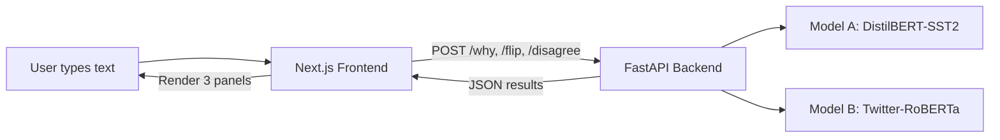
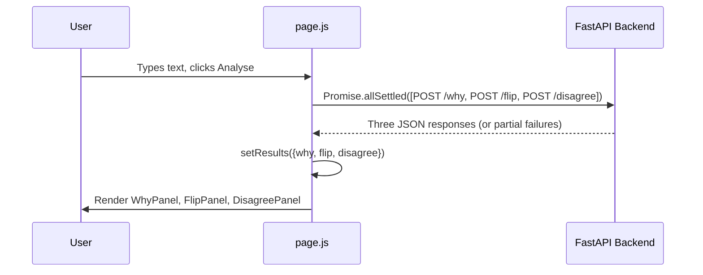

# How XAI Forensics Works 

## Big Picture in One Sentence

User pastes text. Backend runs three different "stress tests" on two sentiment models. Frontend renders results in three panels: WHY, FLIP, DISAGREE.

---

## Architecture



| Layer | Tech | Where |
|-------|------|-------|
| Frontend | Next.js (React) | Vercel |
| Backend | FastAPI (Python) | Hugging Face Spaces (Docker) |
| Models | HuggingFace `pipeline()` | Loaded once at startup |

No database. No cache. No queue. No auth. Stateless per request.

---

## The Two Models

| Model | Trained on | Good at | Bad at |
|-------|-----------|---------|--------|
| **DistilBERT-SST2** | SST-2 movie reviews (formal English) | Clean, formal text | Slang, sarcasm, internet speak |
| **Twitter-RoBERTa** | 124M tweets (informal English) | Sarcasm, abbreviations, informal tone | Overly formal text |

Both loaded at import time via `pipeline("text-classification", model=..., top_k=None)`. `top_k=None` returns all class scores (needed for LIME).

Key design choice: these models genuinely disagree on informal text. That disagreement is real, not staged.

---

## Panel 01: WHY (Token Attribution via LIME)

### What happens:

```
User text: "I am not entirely unhappy with this result."
                    |
                    v
         LimeTextExplainer
                    |
     Generate 300 perturbed versions
     (randomly mask words each time)
                    |
     Run Model A on all 300 versions
                    |
     Fit a local linear model to estimate
     each word's contribution to the prediction
                    |
                    v
     Output: [(token, weight), (token, weight), ...]
```


LIME asks: "If I randomly blank out words, how does the prediction change?" It does this 300 times. Then fits a simple linear model around those perturbations. The weights of that linear model tell you which words mattered most locally.

- **Positive weight** = word pushed toward positive class
- **Negative weight** = word pushed toward negative class
- **Larger absolute value** = bigger influence

### Code path:

1. [analyser.py:explain_why()](file:///d:/xai_forensic/backend/analyser.py#L38-L64) creates `LimeTextExplainer`
2. LIME calls [_model_a_proba()](file:///d:/xai_forensic/backend/analyser.py#L27-L35) 300 times with perturbed text
3. `_model_a_proba` runs Model A on each perturbed version, returns `[negative_prob, positive_prob]` array
4. LIME fits local model, returns `explanation.as_list()` = list of (token, weight) tuples
5. Backend returns label, confidence, and token weights as JSON

### Why LIME and not SHAP or attention?

- SHAP: slower on transformers, expensive on free-tier CPU
- Attention weights: not reliable explanations (Jain & Wallace, 2019)
- LIME: model-agnostic, widely cited, works on black-box classifiers

### Tradeoff:

LIME runs ~300 model calls per explanation. That is why WHY panel takes 15-45 seconds.

---

## Panel 02: FLIP (Counterfactual via Greedy Token Removal)

### What happens:

```
User text: "I am not entirely unhappy with this result."
                    |
                    v
     For EACH word in the sentence:
        - Remove that one word
        - Run Model A on the remaining text
        - Measure: did positive score change?
                    |
                    v
     Pick the word whose removal caused
     the biggest absolute confidence shift
                    |
                    v
     Output: which word, did verdict flip?, confidence delta
```


FLIP asks: "Is there one word so important that removing it changes the model's mind?" It removes each word one at a time, reruns the model, and finds which removal caused the largest swing.

- **flipped=true**: Removing that word changed the label (e.g., positive to negative)
- **flipped=false, high delta**: Verdict held but confidence shifted (partial sensitivity)
- **flipped=false, low delta**: Prediction stable, not dependent on one word

### Code path:

1. [analyser.py:explain_flip()](file:///d:/xai_forensic/backend/analyser.py#L67-L110) splits text into words
2. Loops through each word, removes it, runs `model_a()` on remaining text
3. Tracks `best_abs_delta` = word whose removal caused biggest `abs(new_pos - base_pos)`
4. Returns original vs modified labels, confidences, delta, and flipped boolean

### Fragility badge logic (frontend):

| Condition | Badge |
|-----------|-------|
| `flipped === true` | FRAGILITY: HIGH (red) |
| `abs(delta) >= 0.2` | FRAGILITY: MEDIUM (yellow) |
| Otherwise | FRAGILITY: LOW (green) |

### Tradeoff:

Greedy removal is O(n) in sentence length. Fast and deterministic, but removal can create ungrammatical text. Does not try synonym replacement or masked infill (future upgrade path).

---

## Panel 03: DISAGREE (Dual-Model Divergence)

### What happens:

```
User text: "I am not entirely unhappy with this result."
                    |
             +------+------+
             |             |
         Model A       Model B
       (DistilBERT)  (RoBERTa-Twitter)
             |             |
        pos_score_a   pos_score_b
             |             |
             +------+------+
                    |
          divergence = abs(pos_a - pos_b)
          models_agree = (label_a == label_b)
```


Run same text through both models. Compare their positive-class confidence scores. High divergence = text is ambiguous across training domains. If labels actually differ, text genuinely confused one model.

### Code path:

1. [analyser.py:explain_disagree()](file:///d:/xai_forensic/backend/analyser.py#L113-L142) runs both pipelines
2. Extracts positive score from each using [_get_positive_score()](file:///d:/xai_forensic/backend/analyser.py#L17-L24) (looks for label containing "pos")
3. `divergence = abs(pos_a - pos_b)`, `models_agree = (label_a == label_b)`
4. Returns both model results + divergence + agreement boolean

### Why abs() and not KL divergence?

KL divergence is symmetric-theoretic, harder to explain to non-technical audience. Plain absolute difference is interpretable: "Model A says 85% positive, Model B says 30% positive, gap is 55 points."

### Tradeoff:

Only two forward passes, so fast (under 1 second). But only compares two specific models, not a broader ensemble.

---

## API Layer

[main.py](file:///d:/xai_forensic/backend/main.py) is thin. Three POST endpoints + one combined:

| Endpoint | Does | Calls |
|----------|------|-------|
| `POST /why` | Token attribution | `analyser.explain_why()` |
| `POST /flip` | Counterfactual removal | `analyser.explain_flip()` |
| `POST /disagree` | Dual-model comparison | `analyser.explain_disagree()` |
| `POST /analyse` | All three combined | All three sequentially |

All accept `{"text": "..."}`, validate length (max 1000 chars), return JSON + `duration_ms`.

CORS wide open (`allow_origins=["*"]`). No auth. Public demo.

---

## Frontend Data Flow



Key frontend decisions:

- **`Promise.allSettled`** not `Promise.all`: if one endpoint fails, other panels still render
- **Per-panel error handling**: each panel can show its own error independently
- **Fatal error banner**: only if ALL three fail with network error
- **ForensicSummary**: combines signals from all three panels into a stability verdict (STABLE / FRAGILE / DOMAIN-SENSITIVE / FRAGILE AND DOMAIN-SENSITIVE)

---

## Conclusion

| Panel | Question it answers | Method | Speed |
|-------|-------------------|--------|-------|
| **WHY** | Which words drove this verdict? | LIME (300 perturbations) | Slow (15-45s) |
| **FLIP** | Can removing one word change the verdict? | Greedy token removal | Medium (2-10s) |
| **DISAGREE** | Does a differently-trained model agree? | Dual forward pass | Fast (<1s) |

Sentiment is just the test domain. The real project is about inspecting model behavior - making black-box decisions transparent and testable.
